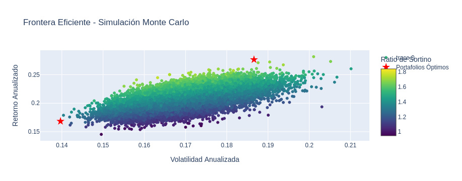
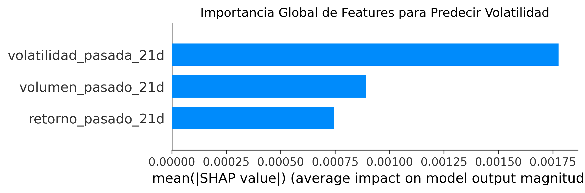

# Optimización de Portafolio (ML)

## Resumen del Proyecto 
Este proyecto desarrolla un sistema cuantitativo de principio a fin para la optimización de un portafolio de múltiples activos (20 acciones y bonos del tesoro). El sistema integra la **Teoría Moderna de Portafolios** con un modelo de **Machine Learning** (XGBRegressor) para ajustar la estrategia de inversión de forma dinámica, adaptándose al riesgo de mercado predicho.

El flujo de trabajo se divide en dos fases principales, encapsuladas en dos notebooks:
1.  **Obtención y Almacenamiento de Datos:** Se crea un pipeline de datos robusto para extraer información de activos desde APIs públicas ("finance, FRED) y almacenarlos en una base de datos relacional (**PostgreSQL**).
2.  **Optimización y Modelado de Riesgo:** Se utiliza la data para construir una **Frontera Eficiente** mediante simulación de Monte Carlo, calcular métricas de riesgo clave (**VaR**, **Ratio de Sortino**) y entrenar un modelo para predecir la volatilidad futura, permitiendo una selección estratégica y automatizada del portafolio.



---
## 🚀 Stack Tecnológico
* **Lenguajes:** Python, SQL (PostgreSQL)
* **Librerías de Datos:** Pandas, NumPy
* **ETL y APIs:** yfinance, fredapi, SQLAlchemy
* **Machine Learning:** Scikit-learn, XGBoost
* **Optimización de Hiperparámetros:** Optuna
* **Explicabilidad:** SHAP
* **Visualización:** Plotly, Matplotlib, Seaborn, Kaleido
* **Entorno:** Jupyter Lab, GitHub

---
## Estructura y Metodología del Proyecto
El repositorio está organizado en dos notebooks que cubren todo el ciclo de vida del proyecto:

### 1. obtener_datos.ipynb (Pipeline de Datos - ETL)
Este notebook se encarga de la extracción, transformación y carga de los datos.
* **Extracción:** Descarga de precios históricos de 20 acciones (yfinance) y tasas de bonos del tesoro (FRED API).
* **Transformación:** Limpieza y reestructuración de los datos a un formato "largo" para un almacenamiento flexible y escalable.
* **Carga:** Creación de tablas (datos_acciones, datos_bonos) en una base de datos PostgreSQL y carga de los datos procesados, asegurando la integridad y persistencia de la información.

### 2. opt_riesgo.ipynb (Análisis, Optimización y Modelado)
Este notebook es el núcleo del análisis cuantitativo y de Machine Learning.
* **Ingeniería de Características en SQL:** Carga de datos desde PostgreSQL usando una query SQL que pivota las tablas a un formato "ancho" y calcula features como retornos diarios.
* **Optimización de Portafolio:**
    * Ejecución de una **simulación de Monte Carlo** (+10,000 iteraciones) para generar un universo de portafolios posibles.
    * Cálculo de métricas de riesgo y rendimiento para cada portafolio, incluyendo **VaR Histórico**, **Ratio de Sharpe**, **Ratio de Sortino** y **Ratio de Calmar** (retorno vs. máxima caída).
    * Identificación de los portafolios de **Mínima Volatilidad** y **Máximo Ratio de Sortino**.
    * Visualización interactiva de la **Frontera Eficiente** con Plotly.
* **Modelado de Riesgo con Machine Learning:**
    * Entrenamiento de un XGBRegressor para predecir la volatilidad futura del mercado (usando 'SPY' como proxy).
    * Optimización de hiperparámetros del modelo con Optuna para minimizar el error de predicción.
    * Interpretación de las predicciones con **SHAP** para entender qué factores (volatilidad pasada, retornos, etc.) impulsan la volatilidad del mercado.
* **Estrategia Dinámica:** El sistema utiliza la predicción del modelo de ML para recomendar una estrategia: adoptar el portafolio de **Mínima Volatilidad** en periodos de alto riesgo predicho, o el de **Máximo Ratio de Sortino** en periodos de bajo riesgo.



---
## Cómo Ejecutar el Proyecto

1.  **Clonar el repositorio:**
    ```bash
    git clone [https://github.com/resteban3467/market_risk]
    cd [market_risk]
    ```
2.  **Crear un entorno virtual e instalar dependencias:**
    ```bash
    python -m venv venv
    source venv/bin/activate  # En Windows: venv\Scripts\activate
    pip install -r requirements.txt
    ```
3.  **Configurar credenciales:**
    * Crea un archivo ".env" en la raíz del proyecto.
    * Pobla el archivo con tus credenciales de **PostgreSQL** y tu clave para la **FRED API**:
        ```
        DB_HOST=localhost
        DB_PORT=5432
        DB_NAME=portfolio_db
        DB_USER=tu_usuario
        DB_PASSWORD=tu_contraseña
        FRED_API_KEY=tu_clave_fred_api
        ```
4.  **Ejecutar los notebooks:** Abre Jupyter Lab (jupyter lab) y ejecuta los notebooks en el siguiente orden:
    1.  obtener_datos.ipynb
    2.  opt_riesgo.ipynb

---
## Autor
* **[Esteban Rojas]**
* **LinkedIn:** https://www.linkedin.com/in/esteban-rojas-millar/
* **Email:** [resteban3467@gmail.com]